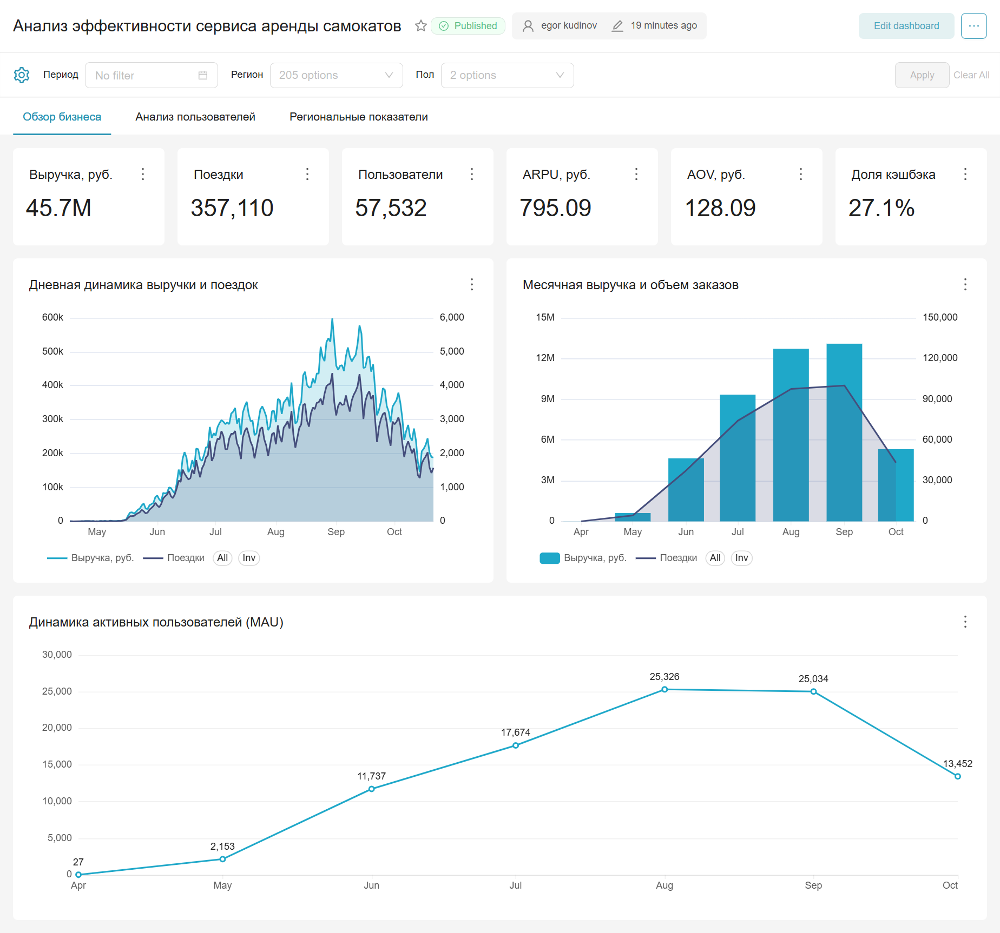
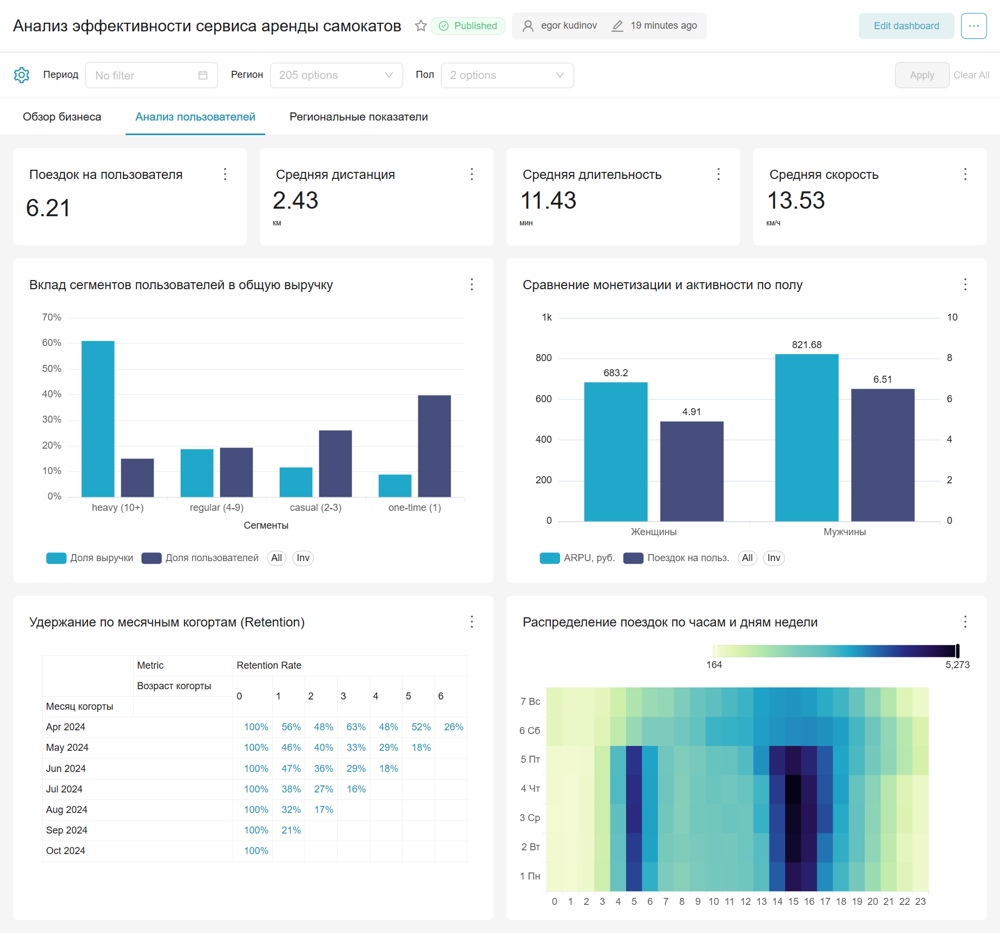
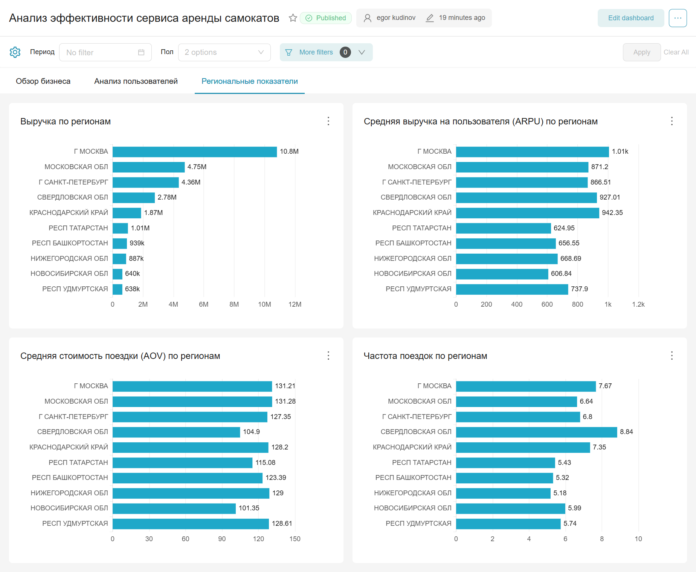

# Анализ эффективности сервиса аренды самокатов

Комплексный анализ данных кикшеринга: от очистки сырых данных до проверки статистических гипотез с бизнес-рекомендациями и интерактивного дашборда.

**Данные:** [Т-Банк | DANO](https://dano.hse.ru/data2024) — 396 тыс. записей о поездках на электросамокатах (Юрент через приложение Т-Банка), сезон апрель-октябрь 2024.

## Ключевые результаты

### Метрики сервиса

| Метрика                  | Значение               |
|--------------------------|------------------------|
| Выручка за сезон         | 45.7 млн руб.          |
| Уникальных пользователей | 57 500+                |
| Поездок                  | 357 000+               |
| AOV (средний чек)        | 128 руб.               |
| ARPU                     | 795 руб.               |
| Avg DAU / WAU / MAU      | 1 399 / 5 571 / 13 629 |

### Главные инсайты

**Женщины — ценный, но теряемый сегмент.** Средний чек у женщин выше на 8 руб. (+7-8%), но retention ниже на 7.55 п.п. (54% против 62%). Сервис теряет каждого второго пользователя женского пола после первой поездки — это **~925 000 руб. упущенной выручки за сезон** (~2% от общей выручки).

**15% пользователей генерируют 61% выручки.** Heavy users (10+ поездок) — ключевой сегмент. Потеря даже малой части критична для бизнеса.

**Реальная стоимость минуты вдвое выше тарифа.** Пользователь видит 7.3 руб/мин, а платит 14.4 руб/мин за счёт фиксированной стоимости активации. На коротких поездках (до 7 мин) эффективная цена минуты в 2–4 раза выше номинала.

**Короткие поездки — индикатор лояльности, а не барьер.** Гипотеза о том, что стоимость активации отпугивает пользователей коротких поездок, опровергнута: их retention выше (64.7% против 58.4%). Регулярные поездки «до метро» формируют привычку.

### Проверенные гипотезы

| №  | Гипотеза             | Результат         | Effect size  | Бизнес-значение                  |
|----|----------------------|-------------------|--------------|----------------------------------|
| H1 | Чек F > M            | ✓ +8 руб.         | r = 0.099    | Женщины ценнее за поездку        |
| H2 | Поездок M > F        | ✓ +1.6 поездки    | r = 0.105    | Женщины менее вовлечены          |
| H3 | Retention M > F      | ✓ +7.55 п.п.      | V = 0.060    | ~925 тыс. руб. упущенной выручки |
| H4 | Выходные > Будни     | ✓ +8 руб.         | r = 0.103    | Потенциал динамических тарифов   |
| H5 | Короткие - ниже ret. | ✗ Обратный эффект | V = 0.058    | Стоимость активации не барьер    |

Для каждой гипотезы рассчитан размер эффекта и 95% доверительный интервал (bootstrap).

### Бизнес-рекомендации

1. **Удержание женской аудитории** — промокод на 2-ю поездку, push через 3–7 дней. Сокращение разрыва retention на 3–4 п.п. даст **~400-500 тыс. руб.** за сезон.
2. **Тарифные эксперименты для выходных** — A/B-тест «выходного абонемента» или повышение тарифа (+5–10%). Готовность платить в выходные выше органически.
3. **Retention разовых пользователей** — таргетировать тех, кто совершил одну длинную поездку и не вернулся в течение 7 дней.
4. **Программа лояльности для heavy users** — система уровней с бонусами за частоту для топ-15% пользователей.

## Дашборд (Apache Superset)

Интерактивный дашборд развёрнут локально через Docker. Содержит мониторинг ключевых KPI, сегментацию пользователей, retention и географический анализ.

### Ключевые метрики (KPI)

*Мониторинг выручки, среднего чека и динамики поездок.*

### Сегментация и Retention

*Анализ поведения и активности пользователей (мужчины/женщины).*

### Географический анализ

*Распределение выручки и активности по регионам.*

## Стек технологий

| Инструмент                                             | Применение                                         |
|--------------------------------------------------------|----------------------------------------------------|
| **Python** (pandas, numpy, scipy, matplotlib, seaborn) | EDA, статистические тесты, bootstrap               |
| **SQL** (PostgreSQL)                                   | Продуктовые метрики, сегментация, когортный анализ |
| **Apache Superset**                                    | BI-дашборд                                         |
| **Docker**                                             | Развёртывание Superset                             |

## Структура проекта

```
kicksharing-analysis/
├── notebooks/
│   ├── 1_data_cleaning.ipynb          # Очистка, типизация, feature engineering
│   ├── 2_exploratory_analysis.ipynb   # EDA, сегментация, формулировка гипотез
│   ├── 3_sql_queries.ipynb            # SQL-метрики, когортный анализ
│   └── 4_metrics_and_hypotheses.ipynb # Проверка гипотез, effect size, CI
├── data/
│   ├── raw/                           # Исходный датасет (не в репозитории)
│   └── clean/                         # Очищенные данные (.parquet, .csv)
├── assets/                            # Скриншоты дашборда
└── superset/                          # Docker-конфигурация Apache Superset
```

## Описание ноутбуков

### 1. Очистка данных

Обработано 396 тыс. записей. Приведены типы данных (экономия памяти на 83%). Обработаны пропуски и выбросы — датасет уменьшен на 10% через двухэтапную фильтрацию (бизнес-логика + 99.9 перцентиль). Создано 7 новых признаков: длительность, скорость, доля кэшбэка, временные метки.

### 2. Разведочный анализ данных (EDA)

Исследованы распределения, корреляции, сезонность и сегменты пользователей. Обнаружен эффект стоимости активации: реальная цена минуты на коротких поездках в 2–4 раза выше тарифа. Выявлены два сценария использования — транспортный (утренний/вечерний пик в будни) и прогулочный (выходные). Сформулировано 9 статистических гипотез.

### 3. SQL-аналитика и метрики

Написано 20+ SQL-запросов в PostgreSQL. Рассчитаны DAU, WAU, MAU, ARPU, Revenue, Retention Rate. Проведена сегментация пользователей (one-time / casual / regular / heavy). Построен когортный анализ: retention падает с 48% (ранние когорты) до 32% (августовская когорта).

### 4. Статистический анализ и гипотезы

Проверены 5 ключевых гипотез. Для каждой: Mann-Whitney U / Chi-squared тест, размер эффекта (rank-biserial / Cramer's V), 95% bootstrap CI, оценка бизнес-эффекта в рублях. Одна гипотеза опровергнута — дала более ценный инсайт, чем если бы подтвердилась.

## Данные

Исходный файл `kicksharing.csv` (~80 МБ) не включён в репозиторий.

Скачать: [kicksharing.csv](https://dano.hse.ru/mirror/pubs/share/987942268.csv)

После скачивания поместите файл в `data/raw/` и запустите `1_data_cleaning.ipynb`.

## Возможности развития

- **Churn prediction** — построить ML-модель предсказания оттока на основе поведенческих признаков (частота, средний чек, тип поездок). Логистическая регрессия, CatBoost, Random Forest.
- **RFM-сегментация** — автоматическая классификация пользователей по Recency, Frequency, Monetary для таргетирования маркетинговых кампаний.

## Автор

**Егор Кудинов** | [Telegram](https://t.me/egorkudinov06) | [GitHub](https://github.com/george-gh5)

Студент 2-го курса РТУ МИРЭА, программная инженерия (ИСППР). Развиваюсь в аналитике данных и продуктовой аналитике.